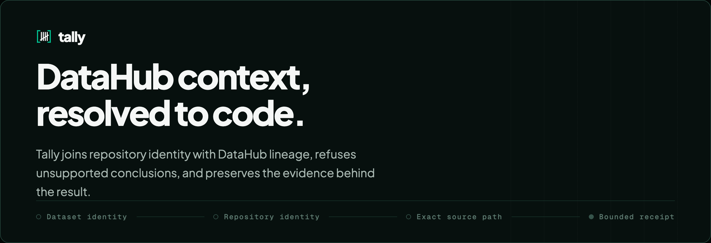
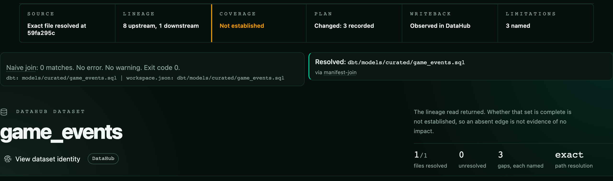
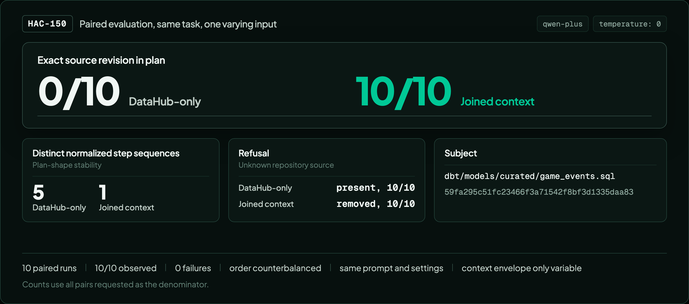
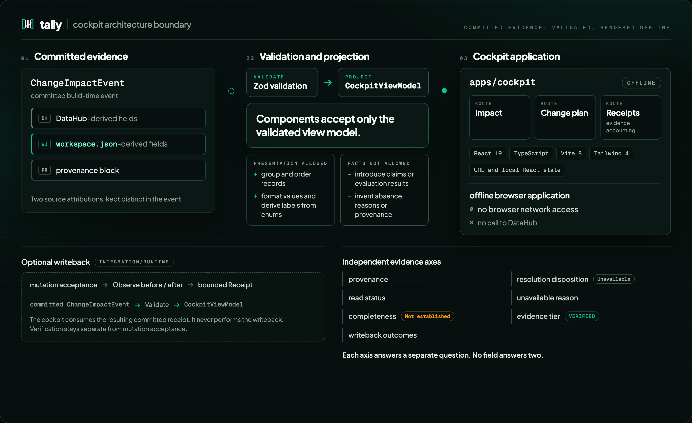
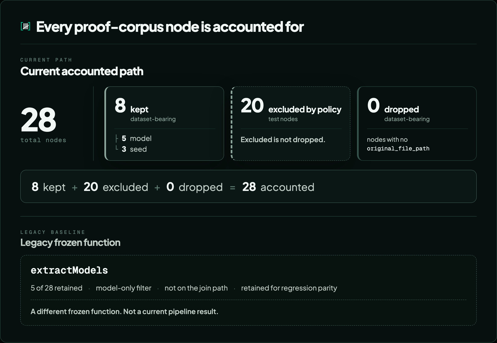
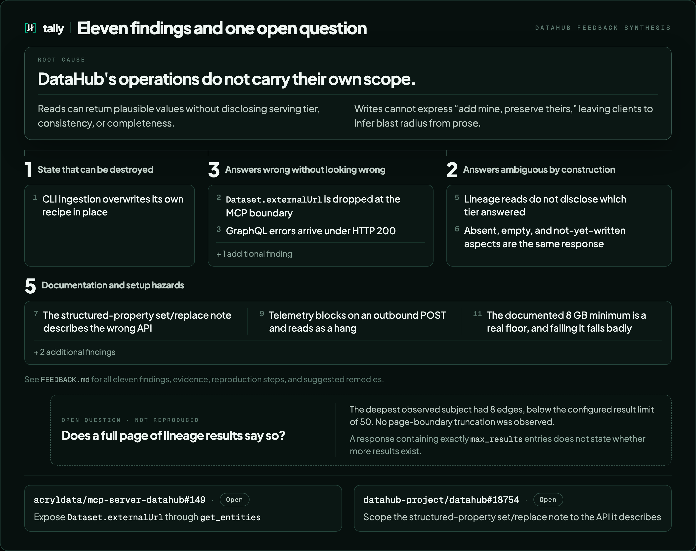

<p align="center">
  
</p>

# A context-safe change impact agent for DataHub

Tally resolves DataHub context to repository code, joins repository identity with catalog lineage, refuses unsupported conclusions, and preserves the evidence behind the result.

<p align="center">
  <b><a href="https://tally.workspacejson.dev/">Open the cockpit</a></b>
  &nbsp;·&nbsp;
  <b><a href="JUDGING.md">Judge in 60 seconds</a></b>
  &nbsp;·&nbsp;
  <b><a href="evaluation/hac-150/">Inspect HAC-150</a></b>
  &nbsp;·&nbsp;
  <b><a href="https://www.workspacejson.dev/showcase/tally">View the showcase</a></b>
</p>

Built with [DataHub](https://datahubproject.io/). Powered by [workspace.json](https://github.com/workspacejson).

## See context change the plan

<p align="center">
  <picture>
    <source media="(prefers-reduced-motion: reduce)" srcset="assets/exports/readme-walkthrough-1440x1100-poster/readme-walkthrough-1440x1100-poster.png">
    
  </picture>
</p>

One click moves from a correct refusal under insufficient repository identity to a checkable plan bound to an exact path and revision. Readers who ask for reduced motion are served the [static opening frame](assets/exports/readme-walkthrough-1440x1100-poster/readme-walkthrough-1440x1100-poster.png) instead, which carries the same evidence.

The DataHub-only state is not a failure. It is the right answer to a question the catalog alone cannot settle, and the walkthrough exists to show that the second state is reached by supplying identity rather than by lowering the bar.

## The failure is silent

DataHub knows a dataset's lineage, schema, and ownership. workspace.json knows the repository at a pinned revision. Joining them sounds trivial: walk from the dataset URN to the dbt model to the file, attach what the repository knows, done.

It returns zero rows, with no error.

dbt reports `original_file_path` relative to the **dbt project root**. Repository evidence is keyed relative to the **git root**. The moment a dbt project lives in a subdirectory, `dbt/` being the common real-world layout, the two path representations differ by exactly that prefix, every lookup misses, and the join hands back an empty result indistinguishable from "this dataset has no interesting history."

<p align="center">
  
</p>

The naive join returns zero matches and exits cleanly. Tally resolves the same dataset to `dbt/models/curated/game_events.sql` through a manifest join at the pinned revision.

A silent zero is the worst failure shape for a metadata join. It alerts nobody and quietly makes the integration useless. Closing it is what Tally exists for.

<details>
<summary>The measured failure, with sources</summary>

| Measure | Value | Source |
| -- | -- | -- |
| Models matched, dbt project at repo root | 5/5 | Perturbation test, `test/integration/golden-fixture.test.ts` |
| Models matched, dbt project nested under `dbt/` | 0/5 | Same perturbation test |
| Process exit code on silent failure | 0 | Measured, `scripts/prove-silent-zero.mjs` |

</details>

See [`docs/claims.md`](docs/claims.md) for the claim ledger backing every figure in this document.

## What joined context changed

<p align="center">
  
</p>

Ten controlled paired runs held task, model, prompt, decoding settings, repository revision, and DataHub snapshot constant. The context envelope was the only varying input. The exact source revision appeared in the plan in 10 of 10 joined-context runs and 0 of 10 DataHub-only runs. DataHub-only produced five distinct normalized step sequences across its ten runs; joined context produced one. Every denominator is the pairs requested, so a run that failed or returned unparsable output would stay in the count rather than leaving it.

This is a controlled comparison on one task with one model at temperature 0. It is not a significance test, not a claim about models in general, and not an error-rate reduction.

Sources, raw outputs, and the aggregation are in [`evaluation/hac-150/`](evaluation/hac-150/).

## Why joined context changes the result

<p align="center">
  
</p>

The two conditions differ in what identity is available, not in how hard the model tried.

- **DataHub-only correctly refuses.** Repository identity is unavailable, so the source location cannot be guessed. Each withheld field is recorded as `not-queried`, which reads as scoped rather than empty.
- **Joined context supplies the exact repository-relative path and pinned revision.** That is the coordinate the catalog does not carry, and having it is what makes a checkable edit possible.
- **Coverage stays qualified.** Supplying identity does not upgrade a completeness claim. The status strip still reads `not-established` where completeness was never established.

## How the cockpit stays honest

<p align="center">
  
</p>

A committed `ChangeImpactEvent` crosses Zod validation before anything renders, and components accept only the resulting `CockpitViewModel`. The browser never calls DataHub: the build reads a committed event and fetches nothing, and a policy test asserts that no module the browser loads can reach the network and no stylesheet loads a remote font. Writeback is not a browser concern at all; it happens in the integration runtime. The evidence axes stay apart, so provenance, read status, completeness, resolution, unavailability, evidence tier, and writeback can each be read without being collapsed into a single verdict.

See [`docs/cockpit-architecture.md`](docs/cockpit-architecture.md).

## Four questions Tally answers

- **Which repository file implements this DataHub dataset?** Tally resolves a dataset URN through the dbt manifest to a repository-root-relative source path, pinned to an immutable commit.
- **Which repository source produces the dataset, and which declared data dependencies surround it?** Tally places the exact revision-bound producer path beside DataHub's upstream and downstream lineage, while keeping repository identity separate from catalog dependency claims.
- **Which conclusions were observed, resolved, complete, or explicitly unknown?** Every fact carries its origin, `datahub` or `workspacejson`, and its standing. Read success, completeness, and absence are stated separately, never collapsed.
- **What durable context was written back to DataHub?** Tally writes a commit-pinned source link and an evidence-tier structured property, then observes the before and after states to produce a receipt.

## What each side contributes

**DataHub provides what no repository tool can.** The dataset URN is the stable identifier everything joins against; without it, "which file produces the customers table" is a string match rather than a resolution. Field-level schema tells a reviewer what columns exist. Lineage edges are declared dependencies, carried alongside repository evidence and kept distinct from it, so a catalog declaration is never read as a repository fact. Owners, domains, and descriptions travel with the dataset and survive the join. And DataHub is where a commit-pinned source link belongs, visible to every catalog consumer rather than buried in a tool-specific store.

**[workspace.json](https://github.com/workspacejson) provides what no catalog can.** The `fileIndex` is keyed by repository-root-relative POSIX paths produced at a pinned commit: the coordinate system that makes the join work, and the one DataHub does not expose through MCP. The artifact carries its own provenance, so Tally can verify that it describes the same repository revision before asserting the exact source location. This bound event does not establish behavioral co-change partners, so Tally does not assert them.

**Tally is the product joining both.** It resolves one through the other and attaches a bounded receipt.

### One concrete example

Resolving `urn:li:dataset:(urn:li:dataPlatform:dbt,duck.dev.game_events,PROD)`:

| Step | Value |
| -- | -- |
| DataHub dataset URN | `urn:li:dataset:(urn:li:dataPlatform:dbt,duck.dev.game_events,PROD)` |
| dbt file path | `models/curated/game_events.sql` |
| Project prefix | `dbt` (project nested under `dbt/`) |
| Repository-relative path | `dbt/models/curated/game_events.sql` |
| workspace.json fileIndex | 131 keys, exact-match integrity |
| Evidence tier | `VERIFIED` — 1 of 1 record(s) carry a check this harness executed |
| Lineage | 8 upstream, 1 downstream, `complete-against-pinned-manifest` completeness |
| Writeback | `succeeded: true`, `bothStatesRead: true`, `noop: true` |

This is the [golden nested fixture](test/fixtures/golden/change-impact-event.nested.json), a real emitted event with an attached writeback receipt, committed so a judge can inspect it without running DataHub.

## Evidence semantics and explicit gaps

Every fact Tally emits carries the standing of the evidence behind it, on axes deliberately kept apart. The full terminology and invariants are in [`docs/evidence.md`](docs/evidence.md).

**Did the catalog answer?** — `read`: `ok`, `failed`, or `not-queried`. `failed` and `not-queried` are not claims about the data. Collapsing them into "no data" is the error the whole contract exists to prevent.

**Was the answer whole?** — `completeness`: `complete-against-pinned-manifest` or `not-established`. A read can succeed and still be partial. DataHub's lineage is search-index backed and that index converges after ingest, so a query can return four edges of twelve, succeed, and look identical to a complete answer. `not-established` is the honest and usually correct state, not a shortfall. The nested fixture (Transfermarkt) carries `complete-against-pinned-manifest` backed by HAC-231's readiness manifests; the root fixture (Jaffle Shop) still carries `not-established` because no readiness manifest was derived for it.

**Why is something missing?** — `unavailable[].reason`: `absent`, `not-queried`, `failed`, `indeterminate`, or `not-exposed-by-source`. `absent` is the strongest: asked, and reported nothing. `indeterminate` exists because the other three could not express it, when the query succeeded, returned something, and completeness is unknown.

**What backs a claim?** — `evidence.records[].checkExecuted` records that a check ran. It does not say the claim is true; that is what `observation` records and what a reviewer judges. The tier (`ASSERTED`, `OBSERVED`, `VERIFIED`) is a mechanical function of the records, and `VERIFIED` is never rendered alone: it carries the record count that produced it.

**Explicit gaps.** `externalUrl` is dropped at the MCP boundary. DataHub holds a commit-pinned source URL, but the official MCP server does not project it for datasets. Tally states this as `not-exposed-by-source` rather than working around it, and the fix is filed upstream. See [`evaluation/mcp-field-coverage.md`](evaluation/mcp-field-coverage.md).

## Writeback and observed receipts

Tally writes two things to DataHub and nothing else: a labelled link from the dataset to the producing file pinned to an immutable commit, and an evidence-tier structured property (`workspacejson_evidence_tier`). Deliberately not written are risk scores, descriptions, editable properties, or anything under a `manual.*` path. A tool that overwrites human-authored fields destroys evidence it did not create.

`bothStatesRead` says the before and after states were both read. `succeeded` requires the mutations to have been accepted **and** the intended state observed. A mutation returning cleanly is not evidence that the write is visible, because DataHub serves stale reads for some seconds afterwards.

<details>
<summary>The five outcomes the receipt keeps apart</summary>

| Fact | Field | What it means |
| -- | -- | -- |
| Success | `succeeded` + `noop` | Mutations accepted and intended state observed |
| Noop | `noop` | Second run against an already-enriched dataset |
| Refusal | `refusedBecause` | Write declined, with reason |
| Omission | `linkOmittedBecause` | Link deliberately not written (no commit-pinned URL) |
| Accepted but not observed | `observation.status` | Mutation returned but intended state not yet visible |

</details>

See the [golden nested fixture](test/fixtures/golden/change-impact-event.nested.json) for a complete receipt, and [`evaluation/clean-quickstart-proof.md`](evaluation/clean-quickstart-proof.md) for an end-to-end transcript.

## Nothing vanishes

<p align="center">
  
</p>

The current join accounts for every node in the pinned proof corpus. The legacy `extractModels` figure belongs to a separate frozen regression baseline and is not a current pipeline result.

Extraction reports every dbt node as *kept*, *excluded*, or *dropped*, under an invariant anyone can check:

```
nodes.length + dropped.length + sum(excluded) === total
```

A node that is dataset-bearing but has no resolvable source file produces a warning naming it. A node excluded by policy, because a dbt test is not a dataset, is counted rather than hidden. On the proof corpus that is 28 of 28 nodes accounted for: 8 kept (5 `model`, 3 `seed`), 20 excluded as `test` nodes, 0 dropped. The count that matters is the total, because a join reporting its exclusions cannot hide one.

The proof corpus is frozen at [`dbt-labs/jaffle_shop_duckdb@36bde6cb`](https://github.com/dbt-labs/jaffle_shop_duckdb/tree/36bde6cba69d962b83be1d52fc65a0dce1cb4ebb) and runs on DuckDB, with no warehouse, no credentials, and no network. See [`evaluation/proof-corpus.md`](evaluation/proof-corpus.md).

**Corpus split.** The judge-facing golden fixture uses the Transfermarkt corpus (`dcaribou/transfermarkt-datasets@59fa295c`), which exercises the nested `dbt/` project layout where a naive join silently returns zero rows. The Jaffle Shop DuckDB corpus is the regression and proof corpus: it backs the node-coverage audit and the clean-room quickstart, and its [root-level fixture](test/fixtures/golden/change-impact-event.root.json) exercises the project-at-repo-root layout. See [Two corpora, two roles](JUDGING.md#two-corpora-two-roles).

## Reproducibility and judge paths

For judge-verified paths from 60 seconds to 15 minutes, see [`JUDGING.md`](JUDGING.md).

From a clean clone:

```bash
npm install
npm test                        # contract, writeback, join, and cockpit suites
npm run typecheck
npm run check:clean-room        # every dependency resolves to a published version
npm run parity:datahub-adapter  # 34/35 against the frozen migration baseline
```

> **Parity prerequisite:** `npm run parity:datahub-adapter` fetches the public
> `workspace-json/agents-audit` repository into `.parity-cache/` on first run.
> It requires network access to GitHub. Set `PARITY_OLD_SIDE` to point at an
> existing checkout to skip the fetch.

**Clean quickstart proof.** The read path, writeback, and reset run end-to-end against a DataHub instance destroyed and rebuilt immediately beforehand. Eleven conditions are asserted from the emitted JSON, not from console output. See [`evaluation/clean-quickstart-proof.md`](evaluation/clean-quickstart-proof.md).

**Node-type coverage.** `original_file_path` is populated for every dbt node type tested (model SQL, model Python, seed, snapshot, source, test) at dbt 1.12.0, with zero nulls. See [`evaluation/dbt-node-coverage.md`](evaluation/dbt-node-coverage.md).

**MCP field coverage.** What DataHub holds versus what an agent receives through the official MCP server. See [`evaluation/mcp-field-coverage.md`](evaluation/mcp-field-coverage.md).

**Live evidence package.** A real MCP event, a writeback receipt, and a paired Qwen plan comparison captured against a live DataHub instance with a nested dbt project. Checksums verified. See [`evaluation/hac-152/`](evaluation/hac-152/).

<details>
<summary>Checked-in artifacts a judge can inspect without running anything</summary>

- [Golden root-level fixture](test/fixtures/golden/change-impact-event.root.json) — real emitted event with writeback receipt, dbt project at repo root
- [Golden nested fixture](test/fixtures/golden/change-impact-event.nested.json) — same, with `dbt/` prefix exercising the normalization
- [Paired Qwen plan comparison](evaluation/hac-152/live-qwen-judge-run-bundle.json) — DataHub-only versus joined, three deltas
- [Live MCP event](evaluation/hac-152/live-mcp-event.json) — read through the official DataHub MCP server
- [Live writeback receipt](evaluation/hac-152/live-event-with-writeback.json) — observed before/after states

See [`examples/README.md`](examples/README.md) for the full index with descriptions.

</details>

For a local DataHub instance (requires Docker):

```bash
python3 -m pip install --upgrade 'acryl-datahub[dbt]'
datahub docker quickstart
```

See [`docs/quickstart.md`](docs/quickstart.md) for the full DataHub setup, MCP server installation, and enrichment workflow.

## What building against DataHub uncovered

<p align="center">
  
</p>

Eleven findings and one open question, distilled in [`FEEDBACK.md`](FEEDBACK.md) with evidence, reproduction steps, and suggested remedies. The open question is counted apart from the eleven because it was never reproduced.

Two are filed as upstream submissions:

- [acryldata/mcp-server-datahub#149](https://github.com/acryldata/mcp-server-datahub/pull/149) — expose `Dataset.externalUrl` through `get_entities` (finding 2)
- [datahub-project/datahub#18754](https://github.com/datahub-project/datahub/pull/18754) — scope the structured-property set/replace note to the API it describes (finding 7)

Both were open as of the asset review date, 2026-08-04. No claim of upstream acceptance, endorsement, merge, or resolution is made.

## Known limitations

1. **Partial completeness claim.** The nested fixture (Transfermarkt) carries `complete-against-pinned-manifest` for both upstreams and downstreams, backed by HAC-231's readiness manifests. The root fixture (Jaffle Shop) still carries `not-established` because no readiness manifest was derived for it. Observed counts are not exhaustiveness claims on their own.
2. **`externalUrl` dropped at MCP boundary.** DataHub holds a commit-pinned source URL; the official MCP server does not project it for datasets. `code.sourceUrl` is null under MCP. The fix is filed upstream.
3. **Shallow corpus history.** 92 commits over five years is thin for co-change and fragility evidence. Any such figure is illustrative, not statistical.
4. **No co-change evidence from the producer.** The workspace.json producer withholds behavioral values by design. The join exercises key membership, not value reading.
5. **Sources point at declaration YAML.** A dbt source's `original_file_path` points at the YAML that declares it, not a model file. Per-source fragility is not separable.
6. **One subject, one corpus per golden fixture.** The nested corpus is exercised by a perturbation test and the live evidence package, not by the root-level golden fixture.
7. **The paired evaluation is one task with one model.** HAC-150 is a controlled comparison at temperature 0, not a significance test and not a claim about model families.

## Ecosystem, provenance, and license

**Tally** is the product. [workspace.json](https://github.com/workspacejson) is the neutral standard producing the repository artifact. [DataHub](https://datahubproject.io/) is the data catalog. Tally joins both.

- **Pre-existing work:** The workspace.json standard, its producer CLI, and the dbt path-normalization adapter in `src/adapters/workspacejson/` were developed before the hackathon and adopted with full provenance. See [`docs/provenance.md`](docs/provenance.md) and [`HACKATHON_PROVENANCE.md`](HACKATHON_PROVENANCE.md).
- **New work:** Non-silent node extraction, the change-impact event contract, the MCP read path, writeback with observed receipts, the paired plan comparison, the cockpit, and all evaluation evidence.
- **Clean-room boundary:** Tally consumes only released, published `@workspacejson/*` packages. No source-level cross-org imports. See [`docs/clean-room.md`](docs/clean-room.md).

**Challenge category:** Metadata-Aware Code Generation & Development

**Technologies demonstrated:** DataHub, dbt, TypeScript, Node.js, DuckDB, Python, Vitest, React, Vite, Tailwind, Playwright

**License:** Apache License 2.0 — see [`LICENSE`](LICENSE).
