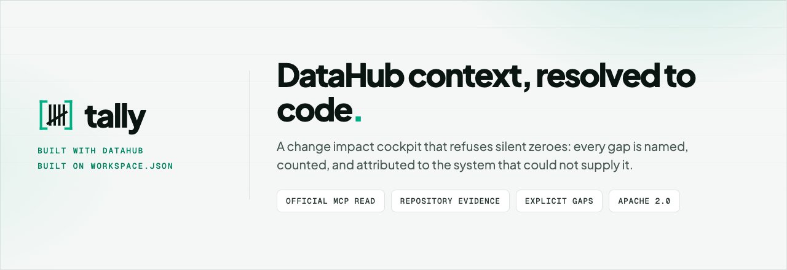

<p align="center">
  <picture>
    <source media="(prefers-color-scheme: dark)" srcset="assets/exports/github-hero-dark-1280x440/github-hero-dark-1280x440.png">
    <source media="(prefers-color-scheme: light)" srcset="assets/exports/github-hero-light-1280x440/github-hero-light-1280x440.png">
    
  </picture>
</p>

Tally resolves DataHub context to repository code, joins code and lineage impact, and attaches a bounded evidence receipt. Tally refuses silent zeros.

Built with [DataHub](https://datahubproject.io/). Powered by [workspace.json](https://github.com/workspacejson).


## Four questions Tally answers

- **Which repository file implements this DataHub dataset?** Tally resolves a dataset URN through the dbt manifest to a repository-root-relative source path, pinned to an immutable commit.
- **What code and downstream data could the change affect?** Tally joins DataHub lineage (upstream and downstream edges) with workspace.json repository evidence, so a reviewer sees both catalog dependencies and behavioral coupling.
- **Which conclusions were observed, resolved, complete, or explicitly unknown?** Every fact carries its origin (`datahub` or `workspacejson`) and its standing — read success, completeness, and absence are stated separately, never collapsed.
- **What durable context was written back to DataHub?** Tally writes a commit-pinned source link and an evidence-tier structured property, then observes the before and after states to produce a receipt.

## The problem

DataHub knows a dataset's lineage, schema, and ownership. Git knows which files change together. Nobody joins them — so an agent working on a data pipeline sees the catalog or the repository, never both at once.

The join sounds trivial. A dbt model is a file. Walk from the dataset URN to the model to the file, attach whatever the repository knows about it, done.

It returns zero rows — silently, with no error.

dbt reports `original_file_path` relative to the **dbt project root**. Repository evidence is keyed relative to the **git root**. The moment a dbt project lives in a subdirectory — `dbt/`, the common real-world layout — the two path representations differ by exactly that prefix, every lookup misses, and the join hands back an empty result that looks indistinguishable from "this dataset has no interesting history."

## Measured silent failure

| Measure | Value | Source |
| -- | -- | -- |
| Models matched, dbt project at repo root | 5/5 | Perturbation test, `test/integration/golden-fixture.test.ts` |
| Models matched, dbt project nested under `dbt/` | 0/5 | Same perturbation test |
| Process exit code on silent failure | 0 | Measured |

A silent zero is the worst possible failure shape for a metadata join. It doesn't alert anyone. It quietly makes the integration useless. That is the problem Tally exists to close.

See [`docs/claims.md`](docs/claims.md) for the claim ledger backing every figure above.

## What Tally does

```
DataHub dataset             customProperties carry dbt_file_path — read, not reconstructed
  → original_file_path        every node accounted for, never silently dropped
  → repo-root-relative key    the normalization that makes the join actually work
  → workspace.json evidence   co-change partners, fileIndex membership
  → change-impact event       lineage + code + evidence, joined and bounded
  → writeback receipt         observed before/after states, not just mutation success
```

Two properties matter more than feature count:

**Nothing vanishes.** Extraction reports every dbt node as *kept*, *excluded*, or *dropped*, under an invariant anyone can check:

```
nodes.length + dropped.length + sum(excluded) === total
```

A node that is dataset-bearing but has no resolvable source file produces a warning that names it. A node excluded by policy (a dbt test is not a dataset) is counted, not hidden.

On the proof corpus that is 28 of 28 nodes accounted for: 8 kept (5 `model`, 3 `seed`), 20 excluded as `test` nodes, 0 dropped. The count that matters is the total, because a join that reports its exclusions cannot hide one.

**Every claim is pinned to evidence.** The proof corpus is frozen at an immutable commit. Fixtures are regenerated by a script that refuses to run against an unpinned checkout. Every coverage number is reproducible from that commit with one command, on any machine, with no warehouse and no credentials.

## One concrete example

Resolving `urn:li:dataset:(urn:li:dataPlatform:dbt,duck.dev.game_events,PROD)`:

| Step | Value |
| -- | -- |
| DataHub dataset URN | `urn:li:dataset:(urn:li:dataPlatform:dbt,duck.dev.game_events,PROD)` |
| dbt file path | `models/curated/game_events.sql` |
| Project prefix | `dbt` (project nested under `dbt/`) |
| Repository-relative path | `dbt/models/curated/game_events.sql` |
| workspace.json fileIndex | 131 keys, exact-match integrity |
| Evidence tier | `VERIFIED` — 1 of 1 record(s) carry a check this harness executed |
| Lineage | 8 upstream, 1 downstream, `not-established` completeness |
| Writeback | `succeeded: true`, `bothStatesRead: true`, `noop: true` |

This is the [golden nested fixture](test/fixtures/golden/change-impact-event.nested.json) — a real emitted event with an attached writeback receipt, committed so a judge can inspect it without running DataHub.

**Corpus split.** The judge-facing golden fixture uses the Transfermarkt corpus (`dcaribou/transfermarkt-datasets@59fa295c`), which exercises the nested `dbt/` project layout where a naive join silently returns zero rows. The Jaffle Shop DuckDB corpus (`dbt-labs/jaffle_shop_duckdb@36bde6cb`) is the regression and proof corpus — it backs the node-coverage audit and the clean-room quickstart, and its [root-level fixture](test/fixtures/golden/change-impact-event.root.json) exercises the project-at-repo-root layout. Both corpora stay visible on judge surfaces; Transfermarkt is the demo subject, Jaffle is the regression proof.

## Why DataHub is essential

DataHub provides what no repository tool can:

- **Canonical asset identity.** The dataset URN is the stable identifier everything joins against. Without it, "which file produces the customers table" is a string match, not a resolution.
- **Schema.** Field-level metadata tells a reviewer what columns exist and what they mean — context a repository cannot supply.
- **Lineage.** Upstream and downstream edges are declared dependencies in the catalog. Tally carries them alongside repository evidence so a reviewer sees both what the catalog declares and how the code actually behaves.
- **Governance context.** Owners, domains, and descriptions travel with the dataset. Tally preserves them through the join rather than dropping them.
- **Writeback destination.** DataHub is where a commit-pinned source link and an evidence tier belong — visible to every consumer of the catalog, not buried in a tool-specific store.

Tally writes back to DataHub because that is where the next agent or reviewer will look.

## What workspace.json contributes

[workspace.json](https://github.com/workspacejson) provides what no catalog can:

- **Revision-bound repository paths.** The `fileIndex` is keyed by repository-root-relative POSIX paths, produced at a pinned commit. This is the coordinate system that makes the join work — and the one DataHub does not expose through MCP.
- **Relationships.** Co-change partners, churn, and fragility signals are repository evidence, not catalog declarations. Tally keeps them separate from lineage so a reviewer can tell the difference.
- **Evidence.** The workspace artifact carries its own provenance — producer identity, file count, repository, and revision — so Tally can verify the artifact describes the same corpus as the DataHub dataset before asserting anything.

**Tally is the product joining both.** DataHub supplies the catalog; workspace.json supplies the repository; Tally resolves one through the other and attaches a bounded receipt.

## DataHub-only versus joined context

Tally's cockpit offers a toggle between two views of the same dataset:

- **DataHub-only:** what an agent consuming only the DataHub MCP server sees. Repository evidence is withheld, and each removal is recorded as `not-queried` so the absence reads as scoped rather than empty.
- **Joined:** DataHub context plus workspace.json evidence, with the exact repository-relative source path and pinned revision.

The difference is measurable. In a [paired Qwen plan comparison](evaluation/hac-152/live-qwen-judge-run-bundle.json), the same model ran both conditions under identical task, prompt, and settings. The joined plan used the exact repository-relative path and revision; the DataHub-only plan explicitly refused the unknown source location. The comparison produced three deltas: added, removed, and constrained.

The runner refuses a DataHub-only answer that does not explicitly acknowledge the missing source, and refuses a joined answer that does not use the exact path. A false positive in either direction is a rejected artifact, not a passed check.

## Architecture

```
src/adapters/workspacejson/   dbt path normalization, fileIndex join
src/integration/              change-impact event contract, MCP read, writeback,
                              plan comparison, workspace evidence
apps/cockpit/                 React UI: Impact → Change plan → Receipts
scripts/                      emitter, writeback runner, fixture generators,
                              paired plan comparison, proof assertions
test/                         contract, writeback, join, cockpit, and fidelity suites
test/fixtures/golden/         committed golden events with writeback receipts
evaluation/                   proof corpus, node-type coverage, MCP field coverage,
                              live evidence packages
```

The cockpit is a React 19 + Vite + Tailwind application. All source events cross Zod validation into a `CockpitViewModel`; components accept only that model. The three-view sequence — Impact, Change plan, Receipts — is the judge-facing surface. See [`docs/cockpit-architecture.md`](docs/cockpit-architecture.md).

The change-impact event contract is at [`src/integration/change-impact-event.ts`](src/integration/change-impact-event.ts). It is versioned (currently 1.3), Zod-validated, and drift-guarded so the TypeScript interfaces and runtime schemas cannot diverge silently.

## Evidence semantics and explicit gaps

Every fact Tally emits carries the standing of the evidence behind it, on axes that are deliberately kept apart. The full terminology and invariants are in [`docs/evidence.md`](docs/evidence.md).

**Did the catalog answer?** — `read`: `ok`, `failed`, or `not-queried`. `failed` and `not-queried` are not claims about the data. Collapsing them into "no data" is the error the whole contract exists to prevent.

**Was the answer whole?** — `completeness`: `complete-against-pinned-manifest` or `not-established`. A read can succeed and still be partial. DataHub's lineage is search-index backed, and that index converges after ingest — so a query can return four edges of twelve, succeed, and look identical to a complete answer. `not-established` is the honest and usually correct state, not a shortfall.

**Why is something missing?** — `unavailable[].reason`: `absent`, `not-queried`, `failed`, `indeterminate`, or `not-exposed-by-source`. `absent` is the strongest: asked, and reported nothing. `indeterminate` exists because the other three could not express it: the query succeeded, returned something, and completeness is unknown.

**What backs a claim?** — `evidence.records[].checkExecuted` records that a check ran. It does not say the claim is true — that is what `observation` records and what a reviewer judges. The tier (`ASSERTED`, `OBSERVED`, `VERIFIED`) is a mechanical function of the records. `VERIFIED` is never rendered alone — it carries the record count that produced it.

**Explicit gaps.** `externalUrl` is dropped at the MCP boundary — DataHub holds a commit-pinned source URL, but the official MCP server does not project it for datasets. Tally states this as `not-exposed-by-source` rather than working around it. The fix is filed upstream. See [`evaluation/mcp-field-coverage.md`](evaluation/mcp-field-coverage.md).

## Writeback and observed receipt

Tally writes two things to DataHub and nothing else:

1. A labelled link from the dataset to the producing file, pinned to an immutable commit.
2. An evidence-tier structured property (`workspacejson_evidence_tier`).

Deliberately not written: risk scores, descriptions, editable properties, or anything under a `manual.*` path. A tool that overwrites human-authored fields destroys evidence it did not create.

The receipt keeps five outcomes apart:

| Fact | Field | What it means |
| -- | -- | -- |
| Success | `succeeded` + `noop` | Mutations accepted and intended state observed |
| Noop | `noop` | Second run against already-enriched dataset |
| Refusal | `refusedBecause` | Write declined, with reason |
| Omission | `linkOmittedBecause` | Link deliberately not written (no commit-pinned URL) |
| Accepted but not observed | `observation.status` | Mutation returned but intended state not yet visible |

`bothStatesRead` says the before and after states were both read. `succeeded` requires the mutations to have been accepted **and** the intended state observed. A mutation returning cleanly is not evidence that the write is visible — DataHub serves stale reads for some seconds afterwards.

See the [golden nested fixture](test/fixtures/golden/change-impact-event.nested.json) for a complete receipt, and [`evaluation/clean-quickstart-proof.md`](evaluation/clean-quickstart-proof.md) for a full end-to-end transcript.

## Evaluation and reproducibility

**Proof corpus.** Frozen at [`dbt-labs/jaffle_shop_duckdb@36bde6cb`](https://github.com/dbt-labs/jaffle_shop_duckdb/tree/36bde6cba69d962b83be1d52fc65a0dce1cb4ebb). Runs on DuckDB — no warehouse, no credentials, no network. A judge can rebuild the exact manifest locally. See [`evaluation/proof-corpus.md`](evaluation/proof-corpus.md).

**Node-type coverage.** `original_file_path` is populated for every dbt node type tested (model SQL, model Python, seed, snapshot, source, test) at dbt 1.12.0 — zero nulls. See [`evaluation/dbt-node-coverage.md`](evaluation/dbt-node-coverage.md).

**Clean quickstart proof.** The read path, writeback, and reset run end-to-end against a DataHub instance that was destroyed and rebuilt immediately beforehand. Eleven conditions are asserted from the emitted JSON, not from console output. See [`evaluation/clean-quickstart-proof.md`](evaluation/clean-quickstart-proof.md).

**Live evidence package.** A real MCP event, a writeback receipt, and a paired Qwen plan comparison, captured against a live DataHub instance with a nested dbt project. Checksums verified. See [`evaluation/hac-152/`](evaluation/hac-152/).

**MCP field coverage.** What DataHub holds versus what an agent receives through the official MCP server. See [`evaluation/mcp-field-coverage.md`](evaluation/mcp-field-coverage.md).

## Quickstart

From a clean clone:

```bash
npm install
npm test                        # contract, writeback, join, and cockpit suites
npm run typecheck
npm run check:clean-room        # every dependency resolves to a published version
npm run parity:datahub-adapter  # 35/35 against the frozen migration baseline
```

For a local DataHub instance (requires Docker):

```bash
python3 -m pip install --upgrade 'acryl-datahub[dbt]'
datahub docker quickstart
```

See [`docs/quickstart.md`](docs/quickstart.md) for the full DataHub setup, MCP server installation, and enrichment workflow.

For judge-verified paths from 60 seconds to 15 minutes, see [`JUDGING.md`](JUDGING.md).

## Examples and judge artifacts

Tally ships checked-in artifacts a judge can inspect without running anything:

- [Golden root-level fixture](test/fixtures/golden/change-impact-event.root.json) — real emitted event with writeback receipt, dbt project at repo root
- [Golden nested fixture](test/fixtures/golden/change-impact-event.nested.json) — same, with `dbt/` prefix exercising the normalization
- [Paired Qwen plan comparison](evaluation/hac-152/live-qwen-judge-run-bundle.json) — DataHub-only versus joined, three deltas
- [Live MCP event](evaluation/hac-152/live-mcp-event.json) — read through the official DataHub MCP server
- [Live writeback receipt](evaluation/hac-152/live-event-with-writeback.json) — observed before/after states

See [`examples/README.md`](examples/README.md) for the full index with descriptions.

## Known limitations

1. **No completeness claim.** Every lineage read carries `not-established`. Observed counts are not exhaustiveness claims. Deriving a pinned expected set is tracked but not yet landed.
2. **`externalUrl` dropped at MCP boundary.** DataHub holds a commit-pinned source URL; the official MCP server does not project it for datasets. `code.sourceUrl` is null under MCP. The fix is filed upstream.
3. **Shallow corpus history.** 92 commits over five years is thin for co-change and fragility evidence. Any such figure is illustrative, not statistical.
4. **No co-change evidence from the producer.** The workspace.json producer withholds behavioral values by design. The join exercises key membership, not value reading.
5. **Sources point at declaration YAML.** A dbt source's `original_file_path` points at the YAML that declares it, not a model file. Per-source fragility is not separable.
6. **One subject, one corpus per golden fixture.** The nested corpus is exercised by a perturbation test and the live evidence package, not by the root-level golden fixture.

## Ecosystem, provenance, and license

**Tally** is the product. [workspace.json](https://github.com/workspacejson) is the neutral standard that produces the repository artifact. [DataHub](https://datahubproject.io/) is the data catalog. Tally joins both.

- **Pre-existing work:** The workspace.json standard, its producer CLI, and the dbt path-normalization adapter in `src/adapters/workspacejson/` were developed before the hackathon and adopted with full provenance. See [`docs/provenance.md`](docs/provenance.md) and [`HACKATHON_PROVENANCE.md`](HACKATHON_PROVENANCE.md).
- **New work:** Non-silent node extraction, the change-impact event contract, the MCP read path, writeback with observed receipts, the paired plan comparison, the cockpit, and all evaluation evidence.
- **Clean-room boundary:** Tally consumes only released, published `@workspacejson/*` packages. No source-level cross-org imports. See [`docs/clean-room.md`](docs/clean-room.md).
- **Upstream contributions:** The `externalUrl` MCP projection fix (filed against `acryldata/mcp-server-datahub`) and the `node:fs` type-stub masking defect (filed against `workspacejson/cli`).

**Challenge category:** Metadata-Aware Code Generation & Development

**Technologies demonstrated:** DataHub, dbt, TypeScript, Node.js, DuckDB, Python, Vitest, React, Vite, Tailwind, Playwright

**License:** Apache License 2.0 — see [`LICENSE`](LICENSE).
